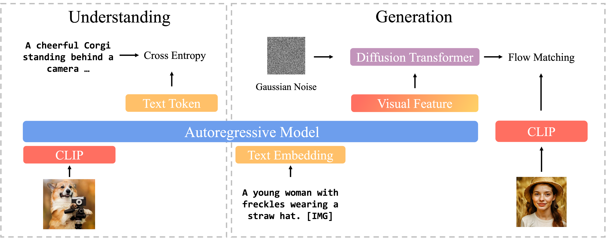

# Pref-Restore: Bridging Information Asymmetry — A Hierarchical Framework for Deterministic Blind Face Restoration

[](https://arxiv.org/abs/2601.19506)
[](https://www.computer.org/csdl/journal/tp)
[](LICENSE)

> Internal codename: `ART-FRv2`. Official code release for our **IEEE TPAMI 2026** paper.
> 📄 **Paper:** [Bridging Information Asymmetry: A Hierarchical Framework for Deterministic Blind Face Restoration](https://arxiv.org/abs/2601.19506) (arXiv:2601.19506)

This repository contains the official **training and inference** code for **Pref-Restore**, a hierarchical framework for blind face restoration that bridges the information asymmetry between a degraded input and its high-quality target via reinforcement-learning–based preference optimization.

---

## 📖 Overview

Blind face restoration aims to reconstruct a detailed, high-quality face from a severely degraded input. The fundamental difficulty is **information asymmetry**: the sparse low-quality (LQ) input carries far less information than the dense high-quality (HQ) target, turning restoration into an ill-posed **one-to-many** problem that yields uncertainty and artifacts.

**Pref-Restore** is a hierarchical framework that *integrates discrete semantic logic with continuous texture generation*, and attacks the asymmetry from two complementary directions:

1. **Augmenting input density.** We employ an **auto-regressive integrator** to reformulate textual instructions into **dense latent queries**, injecting high-level semantics that compensate for the missing information in the LQ input.
2. **Pruning the output distribution.** We pioneer the integration of **on-policy reinforcement learning directly into the diffusion restoration loop**, aligning the model with perceptual preferences and **significantly reducing solution entropy** toward a deterministic, faithful reconstruction.

The result achieves **state-of-the-art performance across both synthetic and real-world benchmarks**.

<p align="center">
  
</p>

The codebase builds on three external repositories that we modified and keep **inline** so the release is self-contained and reproducible:

- **[BLIP-3o (BLIP3o-NEXT)](https://github.com/JiuhaiChen/BLIP3o)** — multimodal Qwen-based backbone (`blip3o/`).
- **[BasicSR](https://github.com/XPixelGroup/BasicSR)** — image-restoration toolbox (`BasicSR/`, with our modifications).
- **[NVlabs/DiffusionNFT](https://github.com/NVlabs/DiffusionNFT)** — diffusion preference-RL backbone (`DiffusionNFT/`, with our modifications).

Their original LICENSE files are preserved.

---

## 📑 Table of Contents

- [Heads-up before you clone](#-heads-up-before-you-clone)
- [Repository layout](#-repository-layout)
- [Installation (environment setup)](#-installation-environment-setup)
- [Required external assets (weights & data)](#-required-external-assets-weights--data)
- [Training](#-training)
- [Inference](#-inference)
- [License](#-license)
- [Citation](#-citation)

---

## ⚠️ Heads-up before you clone

This repository contains **only source code, scripts and configs** (~16 MB).
A full training/inference run additionally requires pretrained backbone weights and reward models that are **NOT redistributed here** — see [Required external assets](#-required-external-assets-weights--data).

Also note: many scripts contain **hardcoded local paths** of the form `/data/phd/yaozhengjian/...`. Replace them with your own paths before running (`grep -rn "/data/phd" .` to find them). We keep them as-is for traceability rather than auto-rewriting.

---

## 🗂 Repository layout

```
Pref-Restore/
├── README.md                          # this file
├── LICENSE                            # Apache-2.0
├── requirements.txt
├── setup.py                           # installs the `blip3o_next` package
├── artfr-run.sh                       # end-to-end command reference (train + infer)
│
├── blip3o/                            # modified BLIP-3o-NEXT backbone
│   ├── data/                          #   degradation pipeline, dataset wrappers
│   ├── model/                         #   Qwen + diffusion-decoder architecture
│   └── train/                         #   SFT training loops (step1/2/3, combined)
│
├── BasicSR/                           # modified BasicSR (kept inline)
├── tok/                               # tokenizer / image-tokenizer assets
├── trl/                               # local copy of TRL with our patches
│
├── DiffusionNFT/                      # modified DiffusionNFT (preference RL)
│   ├── flow_grpo/                     #   our preference-optimization core
│   ├── config/                        #   RL configs (pref_restore*.py)
│   ├── scripts/                       #   RL launchers (train_nft_prefRestore*.py)
│   ├── reward_ckpts/                  #   ⬇  reward models (must be downloaded)
│   ├── dataset/                       #   ⬇  training data (must be prepared)
│   ├── logs/                          #   ⬇  training outputs (created at runtime)
│   └── run.sh                         #   RL training launcher
│
├── scripts/                           # SFT launchers + accelerate/DeepSpeed configs
│   ├── zjyao_i2i*.sh                  #   SFT stage launchers
│   └── zero1.json / zero2.json        #   DeepSpeed ZeRO configs
│
├── generate_degraded_data.py          # build degraded (LQ) inputs from clean targets
├── process_image_degradation.py
├── inference_batch_noPrompt_fixLQ_vae.py        # inference — base (SFT) model
├── inference_batch_noPrompt_fixLQ_vae_lora.py   # inference — RL-finetuned LoRA model
└── figure/                            # paper figures
```

`⬇` marks directories that are **gitignored** but expected to exist locally — see below for how to populate them.

---

## 🔧 Installation (environment setup)

This codebase requires **two separate Python environments**, because the SFT and RL stages depend on incompatible versions of `torch` / `accelerate` / `deepspeed`.

| Env | Used by | Python | Torch | Key packages |
|---|---|---|---|---|
| **`art-fr`** | SFT training (`blip3o/`) + base inference | 3.11 | 2.4 + cu124 | `accelerate==0.28.0`, `deepspeed==0.14.4`, `transformers==4.51.3`, `diffusers==0.34.0` |
| **`DiffusionNFT`** | preference-RL training (`DiffusionNFT/`) + RL / LoRA inference | 3.10 | 2.6 + cu126 | `accelerate==1.4.0`, `deepspeed==0.16.4`, `transformers==4.40.0`, `diffusers==0.33.1`, `flash-attn==2.7.4.post1`, `peft==0.10.0` |

> **Which env do I need?** Look at the top of `artfr-run.sh` — every command block is preceded by the right `conda activate` line.

### Environment 1 — `art-fr` (SFT + base inference)

```bash
conda create -n art-fr python=3.11 -y
conda activate art-fr

# PyTorch 2.4 + CUDA 12.4 (match your driver)
pip install torch==2.4.0 torchvision==0.19.0 torchaudio==2.4.0 \
    --index-url https://download.pytorch.org/whl/cu124

# Project deps
pip install -r requirements.txt

# Install the BLIP-3o-NEXT package (this repo) and our modified BasicSR
pip install -e .
pip install -e BasicSR
```

### Environment 2 — `DiffusionNFT` (preference-RL training + RL / LoRA inference)

```bash
conda create -n DiffusionNFT python=3.10 -y
conda activate DiffusionNFT

# PyTorch 2.6 + CUDA 12.6 (match your driver)
pip install torch==2.6.0 torchvision==0.21.0 torchaudio==2.6.0 \
    --index-url https://download.pytorch.org/whl/cu126

# Install DiffusionNFT (pulls in flash-attn, deepspeed, peft, etc.)
pip install -e DiffusionNFT

# Also install this repo so the inference scripts can `import blip3o`
pip install -e .
```

> **flash-attn note.** `pip install flash-attn==2.7.4.post1` needs the CUDA toolkit + matching torch; if no prebuilt wheel exists for your platform, build from source: `pip install flash-attn==2.7.4.post1 --no-build-isolation`.
>
> The `flex_attention` kernel used by the BLIP-3o decoder ships with PyTorch ≥ 2.5 and works in both envs.

---

## 📦 Required external assets (weights & data)

These directories are **gitignored** and must be populated locally.

### 1. Backbone weights (for SFT)

| Asset | Source | Notes |
|---|---|---|
| TA-Tok image tokenizer | from the BLIP-3o-NEXT release | path set via `VISION_MODEL` in `scripts/zjyao_i2i_step3.sh` |
| SANA 1.5 diffusion decoder | [Efficient-Large-Model / SANA1.5](https://huggingface.co/Efficient-Large-Model) | path set via `DIFFUSION` in the SFT scripts |

### 2. Reward / preference models (for RL) → `DiffusionNFT/reward_ckpts/`

Place the downloaded folders under `DiffusionNFT/reward_ckpts/` (see `DiffusionNFT/reward_ckpts/README.md`).

| Model | Source | Local path |
|---|---|---|
| LAION CLIP-ViT-H/14 | [HF: laion/CLIP-ViT-H-14-laion2B-s32B-b79K](https://huggingface.co/laion/CLIP-ViT-H-14-laion2B-s32B-b79K) | `DiffusionNFT/reward_ckpts/laion/CLIP-ViT-H-14-laion2B-s32B-b79K/` |
| PickScore v1 | [HF: yuvalkirstain/PickScore_v1](https://huggingface.co/yuvalkirstain/PickScore_v1) | `DiffusionNFT/reward_ckpts/yuvalkirstain/PickScore_v1/` |
| OpenAI CLIP-ViT-L/14 | [HF: openai/clip-vit-large-patch14](https://huggingface.co/openai/clip-vit-large-patch14) | `DiffusionNFT/reward_ckpts/openai/clip-vit-large-patch14/` |
| HPS v2.1 | [GitHub: tgxs002/HPSv2](https://github.com/tgxs002/HPSv2) | `DiffusionNFT/reward_ckpts/HPS_v2.1_compressed.pt` |

> The GT-aware reward variant (`scripts/run_gt.sh`) additionally uses landmark (LMD) and ArcFace identity rewards; see `DiffusionNFT/config/pref_restore_gt.py`.

### 3. Datasets

| Dataset | Source | Used for |
|---|---|---|
| FFHQ-256 / FFHQ-512 | [official FFHQ](https://github.com/NVlabs/ffhq-dataset) | training targets |
| CelebA-HQ | [CelebA-HQ](https://github.com/tkarras/progressive_growing_of_gans) | training / validation |
| Synthetic degraded pairs | generated locally — see `generate_degraded_data.py` | SFT supervision |
| Real-world FR test sets (LFW-Test, WebPhoto-Test, WIDER-Test, CelebChild-Test) | standard blind-FR benchmarks | inference inputs |

Generate the synthetic (LQ, HQ) training pairs:

```bash
conda activate art-fr
python generate_degraded_data.py   # edit the in-script paths first
```

The SFT scripts consume a plain-text manifest (`DATA_PATH=.../train_data*.txt`); the inference scripts consume a JSON list of LQ images (`--json_path .../captions_lq.json`). Edit the hardcoded paths to point to your own copies.

---

## 🏋️ Training

The full pipeline is **two stages**. See `artfr-run.sh` for the exact command sequence.

### Stage A — Hierarchical SFT of the backbone  `[env: art-fr]`

Three sub-stages (toggle caption / reconstruction options in `blip3o/data/dataset.py`):

```bash
conda activate art-fr
bash scripts/zjyao_i2i_step3.sh        # step3: VAE + diffusion head
bash scripts/zjyao_i2i.sh
bash scripts/zjyao_i2i_combined.sh
```

Trainers live in `blip3o/train/` (`train.py`, `train_step2.py`, `train_step3.py`, `train_combined.py`); DeepSpeed configs are under `scripts/zero1.json` / `scripts/zero2.json`.

### Stage B — Preference RL with DiffusionNFT  `[env: DiffusionNFT]`

```bash
conda activate DiffusionNFT
cd DiffusionNFT
export WANDB_PROJECT=DiffusionNFT_PrefRestore

# Main pipeline: multi-reward preference optimization
torchrun --nproc_per_node=8 --master_port=11234 \
    scripts/train_nft_prefRestore.py \
    --config config/pref_restore.py:pref_restore_multi_reward

# GT-aware variant (PickScore + HPSv2 + CLIPScore + LMD + ArcFace)
bash scripts/run_gt.sh pref_restore_gt_reward
```

| Script | Config | Description |
|---|---|---|
| `scripts/train_nft_prefRestore.py` | `config/pref_restore.py` | main multi-reward preference RL (paper method) |
| `scripts/train_nft_prefRestore_gt.py` | `config/pref_restore_gt.py` | GT-aware variant with landmark + ArcFace rewards |

RL checkpoints (including LoRA adapters) are written to `DiffusionNFT/logs/` (gitignored).

---

## 🖼 Inference

Two entry points, matching the two stages. Both read a JSON list of LQ images and write restored images to `--output_dir`.

### Base (SFT) model  `[env: art-fr]`

```bash
python inference_batch_noPrompt_fixLQ_vae.py \
    --model_path /path/to/SFT_checkpoint \
    --json_path  /path/to/captions_lq.json \
    --output_dir /path/to/results/base
```

### RL-finetuned (LoRA) model  `[env: DiffusionNFT]`

```bash
python inference_batch_noPrompt_fixLQ_vae_lora.py \
    --model_path /path/to/SFT_checkpoint \
    --json_path  /path/to/captions_lq.json \
    --output_dir /path/to/results/rl \
    --lora_path  /path/to/DiffusionNFT/logs/.../checkpoints/checkpoint-XXX \
    --use_lora
```

| Argument | Meaning |
|---|---|
| `--model_path` | the SFT backbone checkpoint (Stage A output) |
| `--json_path` | JSON list of low-quality input images |
| `--output_dir` | where restored images are saved |
| `--lora_path` | RL LoRA adapter (LoRA script only) |
| `--use_lora` | enable the LoRA adapter (LoRA script only) |

---

## 📜 License

This repository is released under the **Apache License 2.0** (see `LICENSE`).

The inlined third-party code retains its original license:

- `BasicSR/` — Apache-2.0 (XPixelGroup)
- `DiffusionNFT/` — original LICENSE preserved at `DiffusionNFT/LICENSE`
- `blip3o/` — see the upstream BLIP-3o repository

---

## 📚 Citation

If you find this work useful, please cite our paper:

```bibtex
@article{yao2026prefrestore,
  title   = {Bridging Information Asymmetry: A Hierarchical Framework for Deterministic Blind Face Restoration},
  author  = {Yao, Zhengjian and Hu, Jiakui and Li, Kaiwen and He, Hangzhou and
             Zhang, Xinliang and Zeng, Shuang and Zhu, Lei and Lu, Yanye},
  journal = {IEEE Transactions on Pattern Analysis and Machine Intelligence (TPAMI)},
  year    = {2026}
}
```

Preprint: [arXiv:2601.19506](https://arxiv.org/abs/2601.19506)
